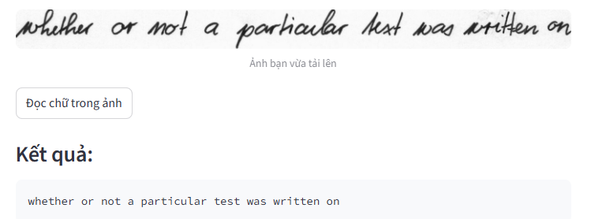
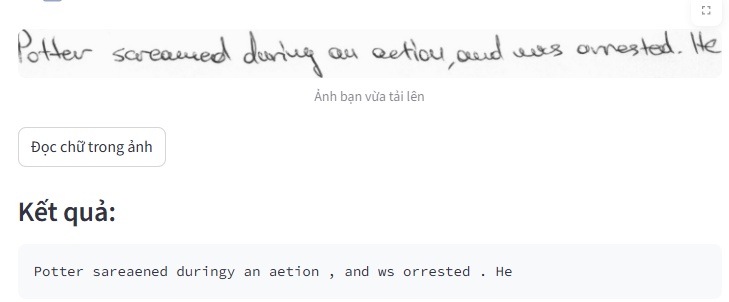
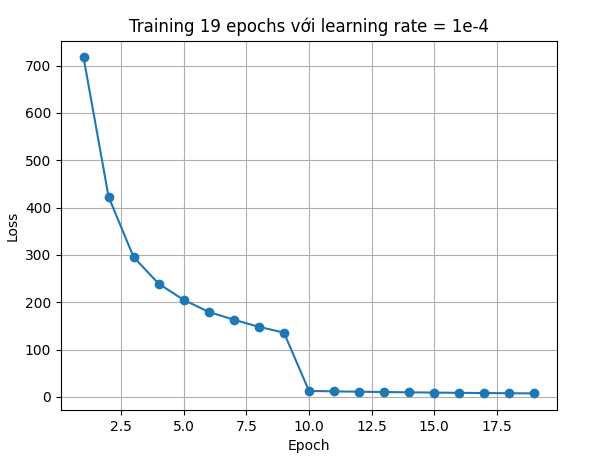
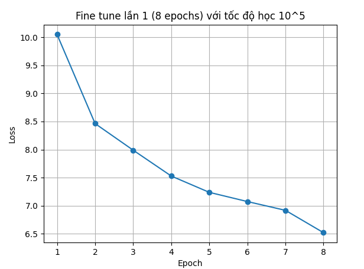
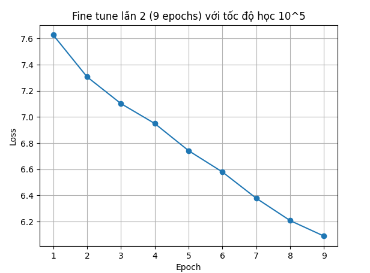

# Nhận diện chữ viết tay(Optical Character Recognition)

# 1. Giới thiệu
Model nhận dạng chữ viết tay  
Tập dữ liệu : IAM
Link

# 2. Cấu trúc thư mục
src/  
├── __pycache__/  
├── checkpoints/  
├── iam-dataset/ 
├── __init__.py  
├── .gitignore  
├── app.py  
├── check.py  
├── config.py  
├── data_loader.py  
├── download_data.py  
├── fine_tune.py  
├── image.png  
├── model.py  
├── requirement.txt  
├── README.md  
├── test.py  
├── train.py  
└── visualization.py  

# 3. Cách cài đặt  
1. Tạo môi trường ảo (nếu cần)

        conda create -n ocr python=3.10

        conda activate ocr

2. Clone code về /home(mở terminal)

        git clone https://github.com/TUDONG05/OCR.git

3. Chạy download_data.py để tải dữ liệu IAM

        python download_data.py
4. Train model bằng cách chạy train.py
( Trước đó nhớ sửa lại các đường dẫn trong file config.py, predict.py nếu chạy bị lỗi)   

        python train.py

    Đã có sẵn model đã được train, có thể chạy website luôn!

5. Đánh giá
    Chạy predict.py để đánh giá ngẫu nhiên và tính WER , CER cả bộ 

        python predict.py
 

6. Chạy website

        streamlit run app.py
# 4. Dataset  
Bộ dữ liệu IAM  
Link: https://huggingface.co/datasets/Teklia/IAM-line  

# 5. Kết quả   

  
-----------------------------------

    CER: 0,1724  
    WER: 0,4587 

Training 19 epochs với tốc độ học 10^4 

Fine tune lần 1 (8 epochs) với tốc độ học 10^5

Fine tune lần 2 (9 epochs) với tốc độ học 10^5

6. Công nghệ sử dụng
    - Python
    - TensorFlow / PyTorch
    - OpenCV
    - NumPy  

7. Môi trường triển khai   

- Hệ điều hành: Ubuntu 24.04 (remote WSL)
- Python: 3.13.9
- Tensorflow: 2.20
- CUDA: 12.4
- Framework: TensorFlow 2.13
- GPU: NVIDIA RTX 3050
- Driver NVIDIA: 551.86